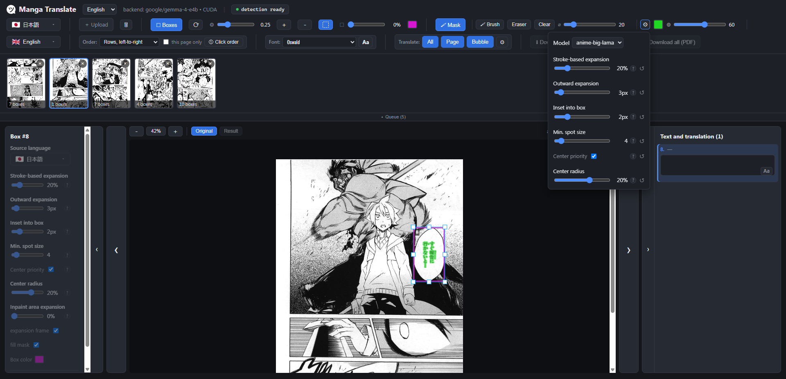

# Manga Translate

> [English version](README.md)

Перевод манги нейросетями: детекция текстовых пузырей → OCR → удаление оригинального текста (inpaint) → перевод через LLM → отрисовка перевода поверх страницы.


Всё работает **нативно** (Python + torch, CUDA). Внешний — только LLM-сервер (любой
OpenAI-совместимый эндпоинт). Docker для самого приложения не нужен.

Учебный проект для [Deep Learning School](https://github.com/DeepLearningSchool).

---



## Возможности

### Быстрый старт

Самый простой сценарий — буквально два действия: **загрузи страницы** (изображения или PDF) и нажми **«Перевести всё»**. Детекция пузырей запускается автоматически сразу после загрузки; перевод идёт потоком — пока LLM переводит одну страницу, следующая уже очищается от текста.

### Ручная правка

Если автоматика не угадала — можно докрутить что угодно:

- **Рамки пузырей** — добавить, подвинуть, растянуть, удалить прямо на canvas. Порог детекции регулируется ползунком.
- **Порядок чтения** — выбрать стратегию (строки слева-направо / справа-налево, колонки) глобально или для отдельной страницы; вручную прокликать нужный порядок.
- **Маска заливки** — перед переводом видно цветовое превью того, что именно будет затёрто. Если автодетекция ошиблась, то можно детально настроить её параметры или просто дорисовать кистью или стереть ластиком.
- **Настройки детекции текста** — расширение по штриху, расширение наружу, отступ от рамки, минимальный размер пятна, приоритет центра — глобально и индивидуально на каждый пузырь.
- **Шрифт и стиль** — шрифт, размер, отступ, выравнивание, наклон, вертикальный столбик, цвет текста, обводка — глобально и на каждый пузырь отдельно.
- **Перевод отдельного пузыря** — выделить рамку и нажать «Перевести бабл»; остальная страница не перерисовывается.
- **Правка текста** — перевод редактируется прямо в боковой панели; «Применить» повторно рендерит без OCR/inpaint/перевода.

### Языки

**Источник OCR:** японский (`manga-ocr`, специализирован под мангу), китайский упрощённый, корейский, английский, испанский, французский, немецкий, португальский, итальянский, польский, венгерский, шведский, русский, украинский, хинди. Язык задаётся глобально на страницу и переопределяется на каждый пузырь (например, английский пузырь в японской манге).

**Цель перевода:** русский, английский, испанский, французский, португальский, немецкий, украинский, шведский, итальянский, польский, венгерский, японский, китайский, корейский, хинди, арабский, иврит.

**Форматы:** JPEG, PNG, WebP, BMP, TIFF, PDF (разбивается на страницы).

---

## Установка

### Требования

- Python 3.10
- [uv](https://docs.astral.sh/uv/) — менеджер пакетов.
- Внешний LLM-сервер (см. ниже).
- **GPU** (опционально, но настоятельно рекомендуется):
  - **Windows / Linux** — NVIDIA GPU с CUDA 12.6+. `uv sync` автоматически скачает CUDA-сборку torch.
  - **macOS Apple Silicon** — используется MPS-ускорение. `uv sync` скачает стандартную PyPI-сборку torch автоматически (ничего редактировать не нужно).
  - **Без GPU** — работает на любой платформе, но медленно.

### Шаги

```powershell
# 0. Установить uv (если ещё не стоит)
# Windows:
powershell -ExecutionPolicy ByPass -c "irm https://astral.sh/uv/install.ps1 | iex"
# macOS / Linux:
curl -LsSf https://astral.sh/uv/install.sh | sh

# 1. Клонировать репозиторий
git clone https://github.com/PSImera/manga_translate
cd manga_translate

# 2. Создать окружение и установить зависимости
uv sync

# 3. Скопировать и заполнить конфиг
copy .env.example .env
```

> Модели manga-ocr, EasyOCR и LaMa скачиваются автоматически при первом запуске.
> manga-ocr, EasyOCR, LaMa и веса детектора пузырей скачиваются автоматически при первом запуске.

---

## Настройка LLM

Приложение **не запускает LLM само** — ему нужен внешний сервер. Поддерживаются:

### Локальная модель (LM Studio / Ollama / vLLM / любой OpenAI-совместимый сервер)

Подойдёт любой сервер с OpenAI-совместимым API. Рекомендую [LM Studio](https://lmstudio.ai/) как наиболее простой вариант.

Рекомендуемая модель — `google/gemma-4-e4b` (или аналогичная ~4B-8B).  
На 8 ГБ VRAM: ~15–20 сек/страница с reasoning; ~3 сек/страница без reasoning (но качество хуже). Качество перевода сильно зависит от модели — экспериментируйте.

В `.env` укажите адрес сервера, ключ и модель:
```env
OPENAI_API_BASE=http://127.0.0.1:1234/v1
OPENAI_API_KEY=lmstudio
MODEL=google/gemma-4-e4b
```

### OpenAI API

```env
OPENAI_API_KEY=sk-...
MODEL=gpt-4o-mini
```

### Anthropic Claude

```bash
uv sync --extra anthropic
```
```env
ANTHROPIC_API_KEY=sk-ant-...
MODEL=claude-haiku-4-5-20251001
```

### Google Gemini

```bash
uv sync --extra google
```
```env
GOOGLE_API_KEY=...
MODEL=gemini-2.0-flash
```

### Grok (xAI)

```env
XAI_API_KEY=...
MODEL=grok-3-mini
```

Провайдер определяется автоматически по заданному `*_API_KEY` (приоритет `OPENAI_API_KEY`), либо явно через `LLM_PROVIDER=openai|anthropic|google|grok`.

---

## Конфигурация (`.env`)

```env
# LLM
MODEL=google/gemma-4-e4b
OPENAI_API_BASE=http://127.0.0.1:1234/v1
OPENAI_API_KEY=lmstudio

# Языки (дефолты, переопределяются из UI)
OCR_LANG=ja           # ja → manga-ocr, иначе EasyOCR
TARGET_LANG=ru

# Устройство OCR
OCR_DEVICE=           # cpu | пусто (= CUDA при наличии)

# Детекция маски инпейнта (дефолты; переопределяются из UI)
INPAINT_MASK_EXPAND=0.2
INPAINT_GROW=3
INPAINT_INSET=2
INPAINT_MIN_AREA=4
INPAINT_CENTER_PRIORITY=true
INPAINT_CENTER_RADIUS=0.10

# Детектор
# YOLO_WEIGHTS=models/bubbles_detect/bubbles_detect.pt

# Контекст LLM при «Перевести всё» (последние N страниц; 0 = без лимита)
LLM_CONTEXT_PAGES=8
```

---

## Запуск

```powershell
.venv\Scripts\python -m uvicorn backend.app:app --host 127.0.0.1 --port 8000
```

На Windows можно просто дважды кликнуть **`start.bat`** в корне репозитория.

Открыть **http://127.0.0.1:8000** — веб-интерфейс раздаётся тем же процессом.

---

## Как пользоваться

1. **Загрузить страницы** — кнопка «＋ Загрузить». PDF разбивается на страницы автоматически. После загрузки детекция пузырей запускается сама.
2. **Выбрать языки** — источник (OCR) и цель (перевод) в шапке.
3. **Нажать «Перевести всё/страницу/бабл»** — пайплайн проходит по всем страницам очереди.
4. **Скачать** — кнопка «Скачать» сохраняет текущую страницу; при переводе всех страниц предлагается ZIP или PDF.

Меню **«⬚ Рамки»** разворачивает инструменты управления рамками пузырей. Меню **«🖌 Маска»** — превью и ручная правка маски заливки. Оба меню сворачиваются, скрывая соответствующие элементы с холста.

**Панель слева** (`›`) — индивидуальные настройки выбранного пузыря.  
**Панель справа** (`‹`) — оригинальный и переведённый текст каждого пузыря с возможностью редактирования и настройки стиля.

---

## Как это работает (кратко)

```
Изображение / PDF
   ↓
Детекция пузырей   YOLOv8 (своя обученная модель, valid mAP50 ≈ 0.977)
   ↓
OCR                manga-ocr (японский) | EasyOCR (остальные)
   ↓
Inpaint            маска штрихов по Otsu + LaMa по кропам пузырей
   ↓
Перевод            внешняя LLM (вся страница одним запросом, JSON-ответ)
   ↓
Рендер             Pillow — вписывание перевода в bbox пузыря
```

**Контекст LLM:** при переводе всей манги каждой следующей странице передаются переводы предыдущих (последние `LLM_CONTEXT_PAGES` страниц) — модель видит сюжет и держит имена/тон.

**Память:** LaMa работает по маленьким кропам пузырей, а не по всей странице во избежание переполнения VRAM.

**Стек:** YOLOv8 · manga-ocr · EasyOCR · LaMa · LangChain · FastAPI · Konva.js · Pillow · pypdfium2 · uv

---

## Шрифты

`.ttf`/`.otf` файлы в `backend/assets/fonts/`. Один файл — отдельная семья; папка с файлами — семья с вариантами (Regular/Bold/…). Поддерживаемые языки определяются автоматически по cmap; кеш в `backend/assets/font_languages.json` обновляется при изменении состава файлов. Принудительная пересборка:

```powershell
.venv\Scripts\python -m backend.pipeline.fonts
```

---

## Датасеты и обучение детектора

Детектор обучен на комбинированном датасете:

- [manga.v4i (Roboflow)](https://universe.roboflow.com/manga-wtdm0/manga-mvbxx) — 1304/189/103 страниц train/valid/test, 1 класс `location-of-bubbles`.
- [1079 дополнительных страниц](https://drive.google.com/drive/folders/198OVEXLxY9hyhC0bdALxtR66BtBHp_Oj?usp=sharing) из репозитория [DLS Manga Translator](https://github.com/ikefir34/DLS_Manga_Translator) — предразметка моделью v1, обученной на первом датасете → CVAT разметка руками → объединение → дообучение модели до версии v2.

Скрипты обучения — в `training/` (для запуска приложения не нужны).

Объединённый датасет опубликован на HuggingFace: [PSImera/manga_bubbles_detect](https://huggingface.co/datasets/PSImera/manga_bubbles_detect).

Веса обученной модели опубликованы на HuggingFace: [PSImera/manga_bubbles_detect](https://huggingface.co/PSImera/manga_bubbles_detect) — скачиваются автоматически при первом запуске.
